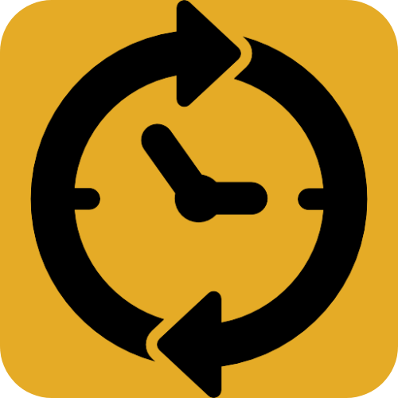
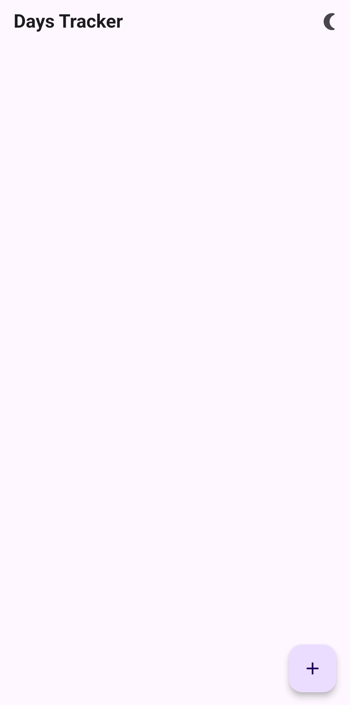
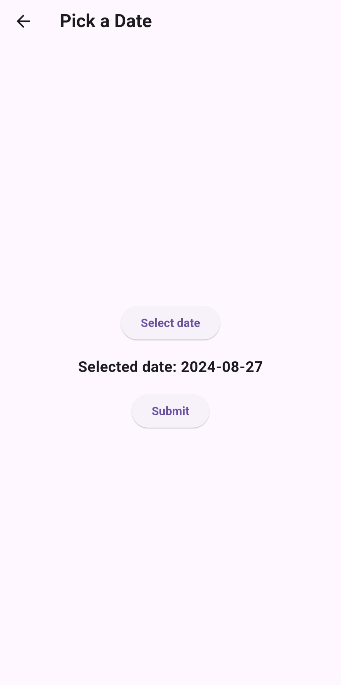
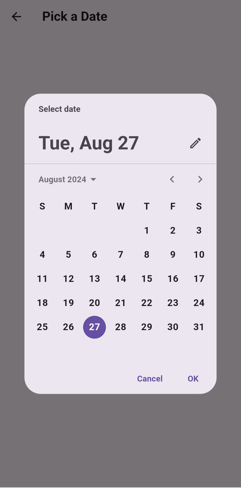
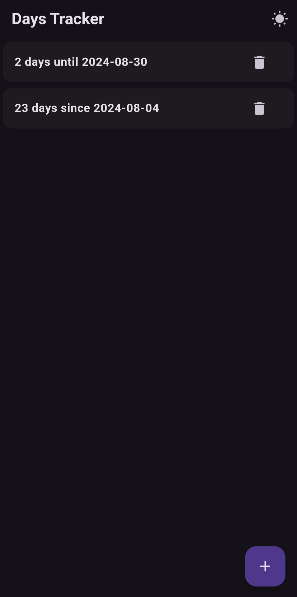

[

](images/DayTrackeR.png)

# Days Tracker

An app in which a user can track days from and to specified date. More features coming soon.

This app has been made possible mainly by using ChatGPT by OpenAi, and some of my minimal knowledge of Flutter and other programming languages.

## Screenshots

